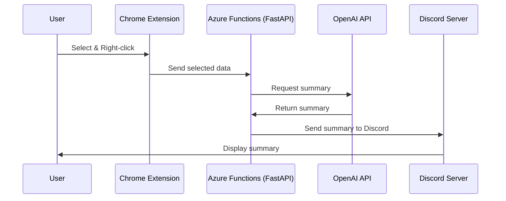

# web2gpt_システム概略図



# 動作には

リポジトリをクローンしてカレントディレクトリを移動
```
git clone https://github.com/matsushitayu/web2gpt_hackason.git
cd web2gpt_hackaso
```

venv環境を作って有効にする
```
python -m venv venv
venv\Scripts\activate
```

必要なパッケージをインストール
```
pip install -r requirements.txt
```

main.pyにOpenAIのAPIキーと、DiscordのWebhook URLを設定

```
# OpenAIのAPIキー
chatgpt_api_key = "sk-＊＊＊＊＊＊＊＊＊"
# DiscordのWebhookのURL
webhook_url = 'https://discord.com/api/webhooks/＊＊＊＊＊＊＊＊＊＊?wait=true'
```

以下のコマンドでlocalhostでFastAPIが立ち上がります
```
uvicorn main:app --reload
```

Chromeをデベロッパーモードにして、/chromeextension/にあるChrome拡張をインストール

これで使えるようになるはずです。

# クラウドへのデプロイが便利
私はAzure Functionsにデプロイして使っています。AWS LambdaやGoogle Cloud Functionsにも同様にデプロイ出来るはずです。localhostでサーバーを動かす必要がないのでとても便利です。おすすめです。なお、不正アクセスを避けるために、APIキーを使った認証などを併用することをお薦めいたします。
