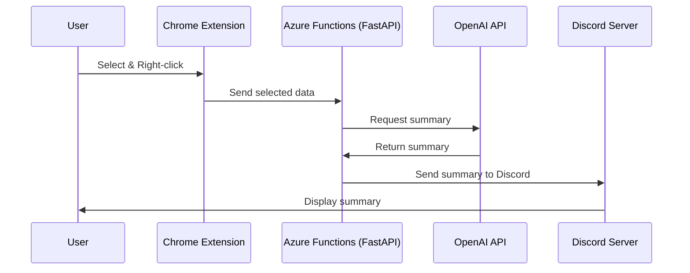

# web2gpt_azure

```mermaid
sequenceDiagram
    participant User as User
    participant Extension as Chrome Extension
    participant AzureFunction as Azure Functions (FastAPI)
    participant OpenAI as OpenAI API
    participant Discord as Discord Server

    User->>Extension: Select & Right-click
    Extension->>AzureFunction: Send selected data
    AzureFunction->>OpenAI: Request summary
    OpenAI->>AzureFunction: Return summary
    AzureFunction->>Discord: Send summary to Discord
    Discord->>User: Display summary
```

